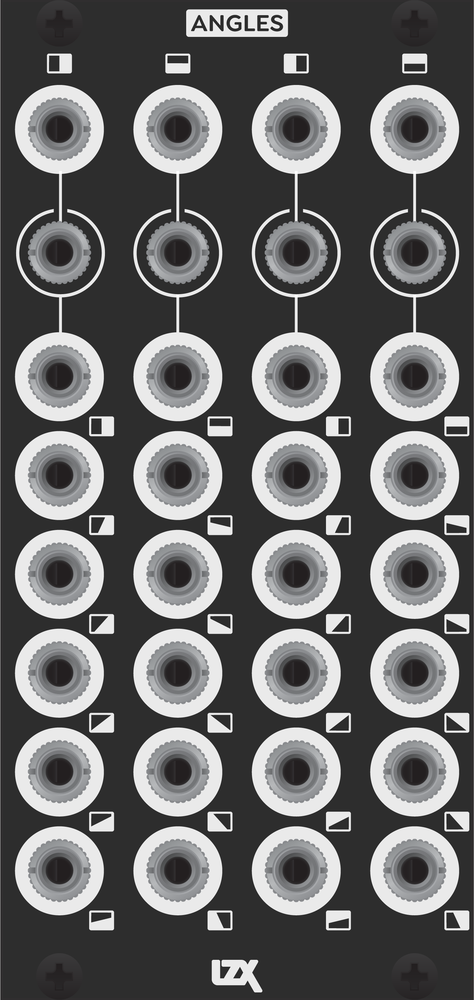
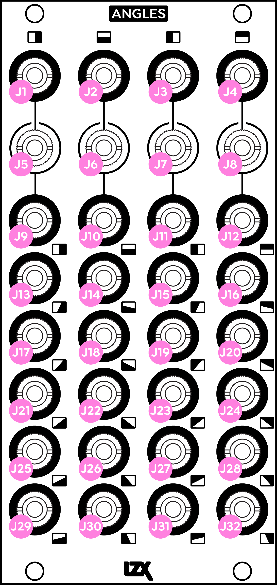

Angles
==========================================

Angles is a dual SD/HD ramp waveform generator and 24 output fixed ratio mixer.  

*Break outside the HV box*

Horizontal and vertical waveform generators are an essential ingredient in most generative patches.  Due to this, many patches may feel constrained within a box, with the dimensions of shapes and patterns either oriented at 0 or 90 degrees.  Angles offers ratio mixes from 0 to 345 degrees in 15 degree increments across 24 ouputs -- that's over 500 different alternatives to HV.  Instead of patching *HV*, you can now *pick any 2 angles*.  

*A protractor for your patch*

In order to synthesize visual elements with complex geometries, such as vanishing point illusions or polygons, one needs parallel access to separate angles at fixed ratios on independent outputs. For this purpose, a single crossfader or mixer does not go very far, and Angles becomes very powerful.

:HP: 12
:Power Consumption +12V: 175mA

System Building Tips
-----------------------

Angles is a great support module to add after your system includes one or more of the following modules: Dual Shape Generator, Dual Wideband Oscillator, Stairs, Keychain.  It really shines in 4+ module systems where its outputs can be distributed throughout the patch to multiple destinations.

Patching Tips
-----------------

- *Waveshape Expander*. Patch your Dual Oscillator outputs or Dual Shape Generator outputs into Angles' inputs to expand the number of available waveforms.
- *Spatial Reference*. Patch any 2 outputs from Angles into your Dual Shape Generator to completely change the orientation of its generated patterns.
- *Oscillator Protractor*. Patch outputs from Angles into your Dual Oscillator CV inputs to modulate its' waveforms at different angles. 
- *Complex Color Field*. Patch any 3 outputs from Angles into RGB to create a complex color gradient for use as a background or modulation source.
- *Quadrature Expander*. Patch the +/-Sin/Cos outputs from a quadrature oscillator into Angles' four inputs to create a full spread of 24 different output phases.
- *Hierarchichal Spatial Reference*. Patch any 4 outputs from one Angles to the 4 input on a second Angles module to get a completely different set of 24 perspectives.

Frontpanel Legend
-----------------------

   
+-----------------------+-------------------------------------------------------------------+
| Ref                   | Description                                                       | 
+=======================+===================================================================+
| J1                    | Horizontal Ramp Out                                               |
+-----------------------+-------------------------------------------------------------------+
| J2                    | Vertical Ramp Out                                                 |
+-----------------------+-------------------------------------------------------------------+
| J3                    | Inverted Horizontal Ramp Out                                      |
+-----------------------+-------------------------------------------------------------------+
| J4                    | Inverted Vertical Ramp Out                                        |
+-----------------------+-------------------------------------------------------------------+
| J5                    | A In (Default Connection: Horizontal Ramp Out)                    |
+-----------------------+-------------------------------------------------------------------+
| J6                    | B In (Default Connection: Vertical Ramp Out)                      |
+-----------------------+-------------------------------------------------------------------+
| J7                    | C In (Default Connection: Inverted Horizontal Ramp Out)           |
+-----------------------+-------------------------------------------------------------------+
| J8                    | D In (Default Connection: Inverted Vertical Ramp Out)             |
+-----------------------+-------------------------------------------------------------------+
| J9                    | 0 Degrees Out (100% A)                                            |
+-----------------------+-------------------------------------------------------------------+
| J13                   | 15 Degrees Out (83.33% A + 16.67% B)                              |
+-----------------------+-------------------------------------------------------------------+
| J17                   | 30 Degrees Out (66.67% A + 33.33% B)                              |
+-----------------------+-------------------------------------------------------------------+
| J21                   | 45 Degrees Out (50% A + 50% B)                                    |
+-----------------------+-------------------------------------------------------------------+
| J25                   | 60 Degrees Out (33.33% A + 66.67% B)                              |
+-----------------------+-------------------------------------------------------------------+
| J29                   | 75 Degrees Out (16.67% A + 83.33% B)                              |
+-----------------------+-------------------------------------------------------------------+
| J10                   | 90 Degrees Out (100% B)                                           |
+-----------------------+-------------------------------------------------------------------+
| J14                   | 105 Degrees Out (83.33% B + 16.67% C)                             |
+-----------------------+-------------------------------------------------------------------+
| J18                   | 120 Degrees Out (66.67% B + 33.33% C)                             |
+-----------------------+-------------------------------------------------------------------+
| J22                   | 135 Degrees Out (50% B + 50% C)                                   |
+-----------------------+-------------------------------------------------------------------+
| J26                   | 150 Degrees Out (33.33% B + 66.67% C)                             |
+-----------------------+-------------------------------------------------------------------+
| J30                   | 165 Degrees Out (16.67% B + 83.33% C)                             |
+-----------------------+-------------------------------------------------------------------+
| J11                   | 180 Degrees Out (100% C)                                          |
+-----------------------+-------------------------------------------------------------------+
| J15                   | 195 Degrees Out (83.33% C + 16.67% D)                             |
+-----------------------+-------------------------------------------------------------------+
| J19                   | 210 Degrees Out (66.67% C + 33.33% D)                             |
+-----------------------+-------------------------------------------------------------------+
| J23                   | 225 Degrees Out (50% C + 50% D)                                   |
+-----------------------+-------------------------------------------------------------------+
| J27                   | 240 Degrees Out (33.33% C + 66.67% D)                             |
+-----------------------+-------------------------------------------------------------------+
| J31                   | 255 Degrees Out (16.67% C + 83.33% D)                             |
+-----------------------+-------------------------------------------------------------------+
| J12                   | 270 Degrees Out (100% D)                                          |
+-----------------------+-------------------------------------------------------------------+
| J16                   | 285 Degrees Out (83.33% D + 16.67% A)                             |
+-----------------------+-------------------------------------------------------------------+
| J20                   | 300 Degrees Out (66.67% D + 33.33% A)                             |
+-----------------------+-------------------------------------------------------------------+
| J24                   | 315 Degrees Out (50% D + 50% A)                                   |
+-----------------------+-------------------------------------------------------------------+
| J28                   | 330 Degrees Out (33.33% D + 66.67% A)                             |
+-----------------------+-------------------------------------------------------------------+
| J32                   | 345 Degrees Out (16.67% D + 83.33% A)                             |
+-----------------------+-------------------------------------------------------------------+
