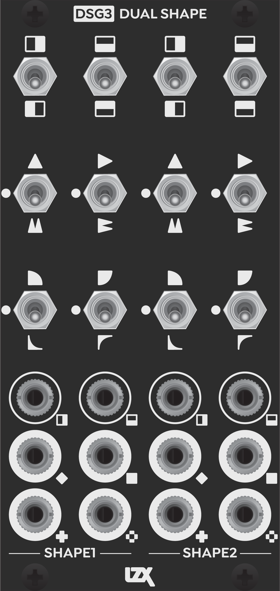
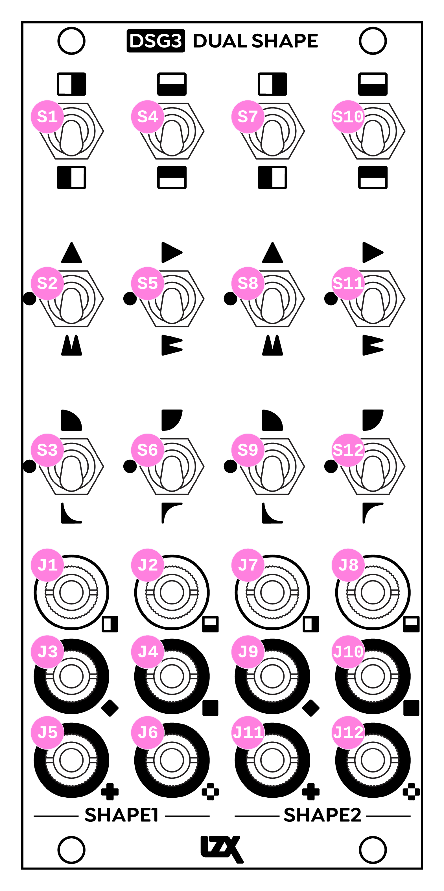

DSG3
==========================================

DSG3 is a complex analog video processor module optimized for generating two independent quadrilateral figures. Toggle switches and patch programmability allow the user access to 2 video waveform generators and 28 analogue function blocks.

- SD/HD Horizontal Ramp Generator with Video Format Auto Detection
- SD/HD Vertical Ramp Generator with Video Format Auto Detection
- 4 Voltage Mirror (1 - N)
- 8 Frequency Doubler
- 4 Logarithmic Amplifier
- 4 Exponential Amplifier
- 2 Summing Amplifier
- 2 Minimum Processor
- 2 Maximum Processor
- 2 Absolute Value Processor

:HP: 12
:Power Consumption +12V: 350mA

Frontpanel Legend
-----------------------

   
+-----------------------+-----------------------+-----------------------------------------------------------+
| Ref                   | Description           | Range                                                     |
+=======================+=======================+===========================================================+
| S1                    | Shape 1 H Invert      | Bypass (Up), Invert (Down)                                |
+-----------------------+-----------------------+-----------------------------------------------------------+
| S2                    | Shape 1 H Fold        | Single Fold (Up), Bypass (Center), Double Fold (Down)     |
+-----------------------+-----------------------+-----------------------------------------------------------+
| S3                    | Shape 1 H Curve       | Logarithmic (Up), Bypass (Center), Exponential (Down)     |
+-----------------------+-----------------------+-----------------------------------------------------------+
| S4                    | Shape 1 V Invert      | Bypass (Up), Invert (Down)                                |
+-----------------------+-----------------------+-----------------------------------------------------------+
| S5                    | Shape 1 V Fold        | Single Fold (Up), Bypass (Center), Double Fold (Down)     |
+-----------------------+-----------------------+-----------------------------------------------------------+
| S6                    | Shape 1 V Curve       | Logarithmic (Up), Bypass (Center), Exponential (Down)     |
+-----------------------+-----------------------+-----------------------------------------------------------+
| S7                    | Shape 2 H Invert      | Bypass (Up), Invert (Down)                                |
+-----------------------+-----------------------+-----------------------------------------------------------+
| S8                    | Shape 2 H Fold        | Single Fold (Up), Bypass (Center), Double Fold (Down)     |
+-----------------------+-----------------------+-----------------------------------------------------------+
| S9                    | Shape 2 H Curve       | Logarithmic (Up), Bypass (Center), Exponential (Down)     |
+-----------------------+-----------------------+-----------------------------------------------------------+
| S10                   | Shape 2 V Invert      | Bypass (Up), Invert (Down)                                |
+-----------------------+-----------------------+-----------------------------------------------------------+
| S11                   | Shape 2 V Fold        | Single Fold (Up), Bypass (Center), Double Fold (Down)     |
+-----------------------+-----------------------+-----------------------------------------------------------+
| S12                   | Shape 2 V Curve       | Logarithmic (Up), Bypass (Center), Exponential (Down)     |
+-----------------------+-----------------------+-----------------------------------------------------------+
| J1                    | Shape 1 H Input       | 0V to +1V, DC coupled, Normalized to H Ramp Generator     |
+-----------------------+-----------------------+-----------------------------------------------------------+
| J2                    | Shape 1 V Input       | 0V to +1V, DC coupled, Normalized to V Ramp Generator     |
+-----------------------+-----------------------+-----------------------------------------------------------+
| J3                    | Shape 1 Sum Output    | 0V to +1V, DC coupled                                     |
+-----------------------+-----------------------+-----------------------------------------------------------+
| J4                    | Shape 1 Min Output    | 0V to +1V, DC coupled                                     |
+-----------------------+-----------------------+-----------------------------------------------------------+
| J5                    | Shape 1 Max Output    | 0V to +1V, DC coupled                                     |
+-----------------------+-----------------------+-----------------------------------------------------------+
| J6                    | Shape 1 Abs Output    | 0V to +1V, DC coupled                                     |
+-----------------------+-----------------------+-----------------------------------------------------------+
| J7                    | Shape 2 H Input       | 0V to +1V, DC coupled, Normalized to H Ramp Generator     |
+-----------------------+-----------------------+-----------------------------------------------------------+
| J8                    | Shape 2 V Input       | 0V to +1V, DC coupled, Normalized to V Ramp Generator     |
+-----------------------+-----------------------+-----------------------------------------------------------+
| J9                    | Shape 2 Sum Output    | 0V to +1V, DC coupled                                     |
+-----------------------+-----------------------+-----------------------------------------------------------+
| J10                   | Shape 2 Min Output    | 0V to +1V, DC coupled                                     |
+-----------------------+-----------------------+-----------------------------------------------------------+
| J11                   | Shape 2 Max Output    | 0V to +1V, DC coupled                                     |
+-----------------------+-----------------------+-----------------------------------------------------------+
| J12                   | Shape 2 Abs Output    | 0V to +1V, DC coupled                                     |
+-----------------------+-----------------------+-----------------------------------------------------------+
   
Video Format Switch
-----------------------

The Rear DIP Switch does not need to be adjusted by the user under typical operation.  In the case that the user wishes to disable the module's sync format auto detection, they may program a specific video format using this rear switch.  This feature is presented as a potential solution to issues with more troublesome setups that may experience losses in signal integrity, for example when the module is used along with an intentionally glitchy video sync source.

0 represents the switch's OFF state. 1 represents the switch's ON state. x indicates a position irrelevant to the listed setting.

+---------------------+--------------+
| Enable Auto Detect  | xxxx0xxx     | 
+---------------------+--------------+
| NTSC                | 00001xxx     | 
+---------------------+--------------+
| PAL                 | 10001xxx     | 
+---------------------+--------------+
| 486p5994            | 01001xxx     | 
+---------------------+--------------+
| 576p50              | 11001xxx     | 
+---------------------+--------------+
| 1080i5994           | 00101xxx     | 
+---------------------+--------------+
| 1080i60             | 10101xxx     | 
+---------------------+--------------+
| 720p5994            | 01101xxx     | 
+---------------------+--------------+
| 720p60              | 11101xxx     | 
+---------------------+--------------+
| 1080i50             | 00011xxx     | 
+---------------------+--------------+
| 1080p2398           | 10011xxx     | 
+---------------------+--------------+
| 720p50              | 01011xxx     | 
+---------------------+--------------+
| 1080p2997           | 11011xxx     | 
+---------------------+--------------+
| 1080p24             | 00111xxx     | 
+---------------------+--------------+
| 1080p25             | 10111xxx     | 
+---------------------+--------------+
| 1080p30             | 01111xxx     | 
+---------------------+--------------+
