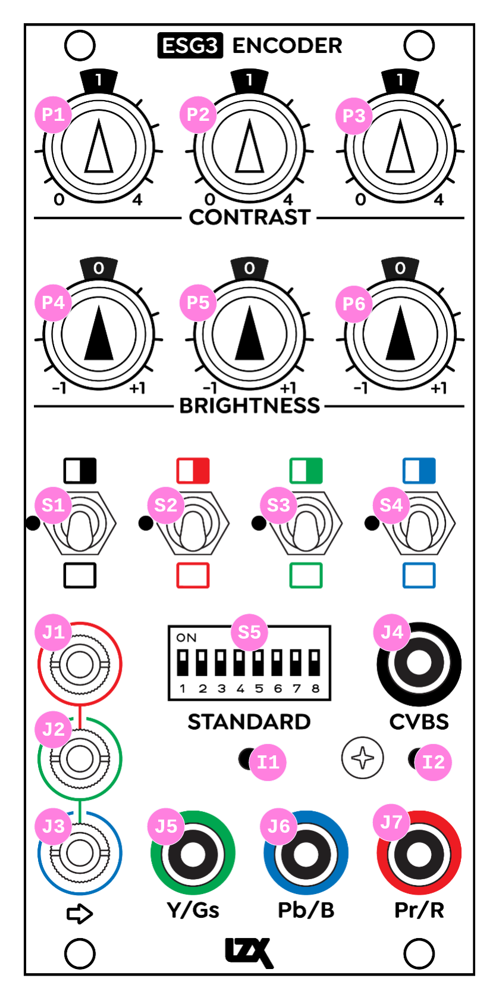

ESG3
=========================================

.. figure:: lzxart/Encoder/LZX12HPEncoderFrontpanelColorGraphicDark.png
   :height: 600
   :alt: ESG3 Encoder & Sync Generator frontpanel

ESG3 is a complex analog video output module supporting SD Composite and SD/HD Component video formats. With 12 analog function blocks on its frontend controls, the user can find results ranging from simple color correction to heavily stylized multi band colorization. 

- RGB Processor / Colorizer
- RGB Inverter
- RGB Mute 
- SD/HD Video Sync Generator supporting NTSC, PAL, 480p, 576p, 720p50, 720p5994, 720p60, 1080i50, 1080i5994, 1080i60, 1080p2398, 1080p24, 1080p25, 1080p2997, 1080p30
- SD/HD Component Video Encoder supporting NTSC, PAL, 480p, 576p, 720p50, 720p5994, 720p60, 1080i50, 1080i5994, 1080i60, 1080p2398, 1080p24, 1080p25, 1080p2997, 1080p30
- SD Composite Video Encoder supporting NTSC and PAL

:HP: 12
:Power Consumption +12V: 300mA

Frontpanel Legend
-----------------------

   
+-----------------------+-----------------------+-----------------------------------------------------------+
| Ref                   | Description           | Range                                                     |
+=======================+=======================+===========================================================+
| P1                    | Red Contrast          | 0x to 4x, 1x                                              |
+-----------------------+-----------------------+-----------------------------------------------------------+
| P2                    | Green Contrast        | 0x to 4x, 1x                                              |              
+-----------------------+-----------------------+-----------------------------------------------------------+
| P3                    | Blue Contrast         | 0x to 4x, 1x                                              |
+-----------------------+-----------------------+-----------------------------------------------------------+
| P4                    | Red Brightness        | -1V to +1V, 0V                                            |
+-----------------------+-----------------------+-----------------------------------------------------------+
| P5                    | Green Brightness      | -1V to +1V, 0V                                            |
+-----------------------+-----------------------+-----------------------------------------------------------+
| P6                    | Blue Brightness       | -1V to +1V, 0V                                            |
+-----------------------+-----------------------+-----------------------------------------------------------+
| S1                    | RGB Function          | Invert (Up), Enable (Center), Mute (Down)                 |
+-----------------------+-----------------------+-----------------------------------------------------------+
| S2                    | Red Function          | Invert (Up), Enable (Center), Mute (Down)                 |
+-----------------------+-----------------------+-----------------------------------------------------------+
| S3                    | Green Function        | Invert (Up), Enable (Center), Mute (Down)                 |
+-----------------------+-----------------------+-----------------------------------------------------------+
| S4                    | Blue Function         | Invert (Up), Enable (Center), Mute (Down)                 |
+-----------------------+-----------------------+-----------------------------------------------------------+
| S5                    | Video Format Switch   | See settings chart below                                  |
+-----------------------+-----------------------+-----------------------------------------------------------+
| J1                    | Red Input             | 0V to +1V, DC coupled                                     |
+-----------------------+-----------------------+-----------------------------------------------------------+
| J2                    | Green Input           | 0V to +1V, DC coupled                                     |
+-----------------------+-----------------------+-----------------------------------------------------------+
| J3                    | Blue Input            | 0V to +1V, DC coupled                                     |
+-----------------------+-----------------------+-----------------------------------------------------------+
| J4                    | Composite Output      | 714mVpp video, 286mVpp sync, 75 ohm impedance, AC coupled |
+-----------------------+-----------------------+-----------------------------------------------------------+
| J5                    | Ys/Gs Output          | 714mVpp video, 286mVpp sync, 75 ohm impedance, AC coupled |
+-----------------------+-----------------------+-----------------------------------------------------------+
| J6                    | Pb/B                  | 714mVpp video, 75 ohm impedance, AC coupled               |
+-----------------------+-----------------------+-----------------------------------------------------------+
| J7                    | Pr/R                  | 714mVpp video, 75 ohm impedance, AC coupled               |
+-----------------------+-----------------------+-----------------------------------------------------------+
| I1                    | Sync Input LED        | Detected (Green), Not Detected (Yellow)                   |
+-----------------------+-----------------------+-----------------------------------------------------------+
| I2                    | Composite Output LED  | Enabled (Green), Disabled (Yellow)                        |
+-----------------------+-----------------------+-----------------------------------------------------------+

Video Format Switch
-----------------------

ESG3's format selection switch determines the module's video output format and video sync standard.  Additionally, the user may select between YPbPr and RGB colorspace modes for the Component output encoder.  In most cases, the user should select the YPbPr component output mode.  Optionally, RGB component output mode may be used with some displays and capture devices if supported.

0 represents the switch's OFF state.  1 represents the switch's ON state.  x indicates a position irrelevant to the listed setting.

+------------+--------------+
| Format     | Setting      |
+============+==============+
| NTSC       | 0000xxxx     | 
+------------+--------------+
| PAL        | 1000xxxx     | 
+------------+--------------+
| 480p5994   | 0100xxxx     | 
+------------+--------------+
| 576p50     | 1100xxxx     | 
+------------+--------------+
| 1080i5994  | 0010xxxx     | 
+------------+--------------+
| 1080i60    | 1010xxxx     | 
+------------+--------------+
| 720p5994   | 0110xxxx     | 
+------------+--------------+
| 720p60     | 1110xxxx     | 
+------------+--------------+
| 1080i50    | 0001xxxx     | 
+------------+--------------+
| 1080p2398  | 1001xxxx     | 
+------------+--------------+
| 720p50     | 0101xxxx     | 
+------------+--------------+
| 1080p2997  | 1101xxxx     | 
+------------+--------------+
| 1080p24    | 0011xxxx     | 
+------------+--------------+
| 1080p25    | 1011xxxx     | 
+------------+--------------+
| 1080p30    | 0111xxxx     | 
+------------+--------------+
| RGB Out    | xxxxxxx1     | 
+------------+--------------+
| YPbPr Out  | xxxxxxx0     | 
+------------+--------------+
