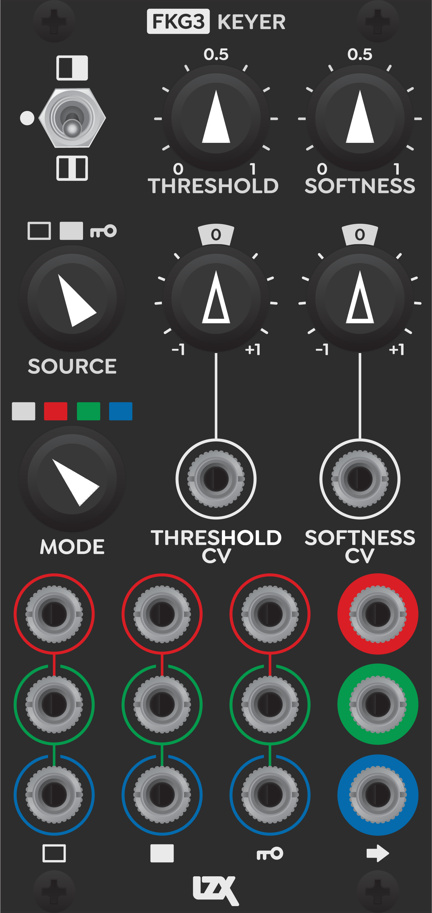
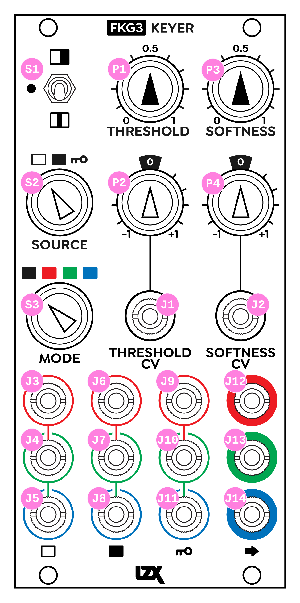

FKG3
=========================================

Frontpanel Legend
-----------------------

   
+-----------------------+-----------------------+-----------------------------------------------------------+
| Ref                   | Description           | Range                                                     |
+=======================+=======================+===========================================================+
| P1                    | Threshold Control     | 0 to +1                                                   |
+-----------------------+-----------------------+-----------------------------------------------------------+
| P2                    | Threshold CV Level    | -1 to +1                                                  |
+-----------------------+-----------------------+-----------------------------------------------------------+
| P1                    | Softness Control      | 0 to +1                                                   |
+-----------------------+-----------------------+-----------------------------------------------------------+
| P2                    | Softness CV Level     | -1 to +1                                                  |
+-----------------------+-----------------------+-----------------------------------------------------------+
| S1                    | Threshold Mode        | Inverted (Up), Default (Middle), Window (Down)            |
+-----------------------+-----------------------+-----------------------------------------------------------+
| S2                    | Keyer Source          | FG (Left), BG (Pos 2), Key (Right)                        |
+-----------------------+-----------------------+-----------------------------------------------------------+
| S3                    | Keyer Mode            | Luma (Left), Red (Pos 2), Green (Pos 3), Blue (Right)     |
+-----------------------+-----------------------+-----------------------------------------------------------+
| J3                    | BG Red Input          | 0V to +1V, DC coupled                                     |
+-----------------------+-----------------------+-----------------------------------------------------------+
| J4                    | BG Green Input        | 0V to +1V, DC coupled                                     |
+-----------------------+-----------------------+-----------------------------------------------------------+
| J5                    | BG Blue Input         | 0V to +1V, DC coupled                                     |
+-----------------------+-----------------------+-----------------------------------------------------------+
| J6                    | FG Red Input          | 0V to +1V, DC coupled                                     |
+-----------------------+-----------------------+-----------------------------------------------------------+
| J7                    | FG Green Input        | 0V to +1V, DC coupled                                     |
+-----------------------+-----------------------+-----------------------------------------------------------+
| J8                    | FG Blue Input         | 0V to +1V, DC coupled                                     |
+-----------------------+-----------------------+-----------------------------------------------------------+
| J9                    | Key Red Input         | 0V to +1V, DC coupled                                     |
+-----------------------+-----------------------+-----------------------------------------------------------+
| J10                   | Key Green Input       | 0V to +1V, DC coupled                                     |
+-----------------------+-----------------------+-----------------------------------------------------------+
| J11                   | Key Blue Input        | 0V to +1V, DC coupled                                     |
+-----------------------+-----------------------+-----------------------------------------------------------+
| J12                   | Red Output            | 0V to +1V, DC coupled                                     |
+-----------------------+-----------------------+-----------------------------------------------------------+
| J13                   | Green Output          | 0V to +1V, DC coupled                                     |
+-----------------------+-----------------------+-----------------------------------------------------------+
| J14                   | Blue Output           | 0V to +1V, DC coupled                                     |
+-----------------------+-----------------------+-----------------------------------------------------------+
