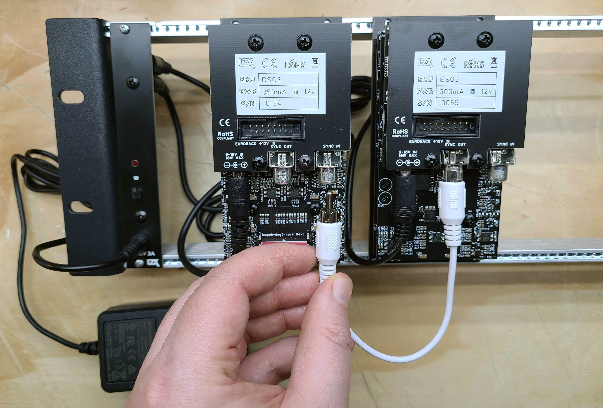
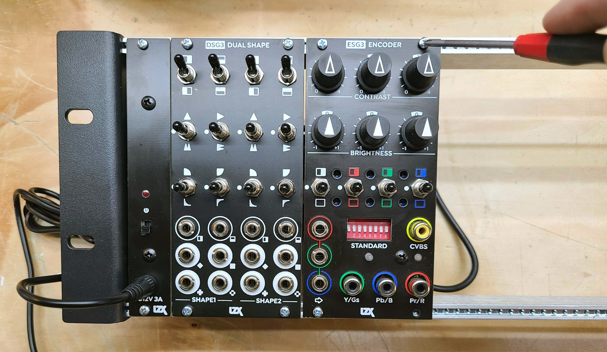
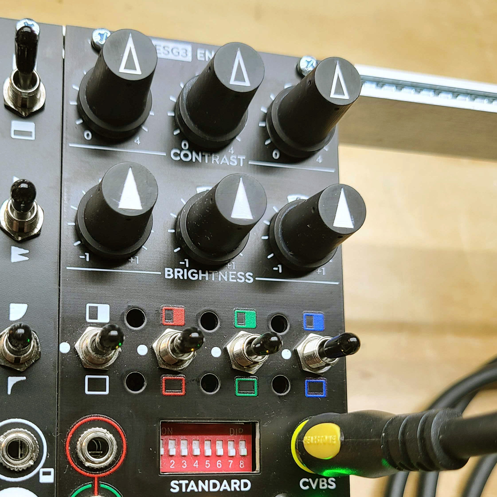
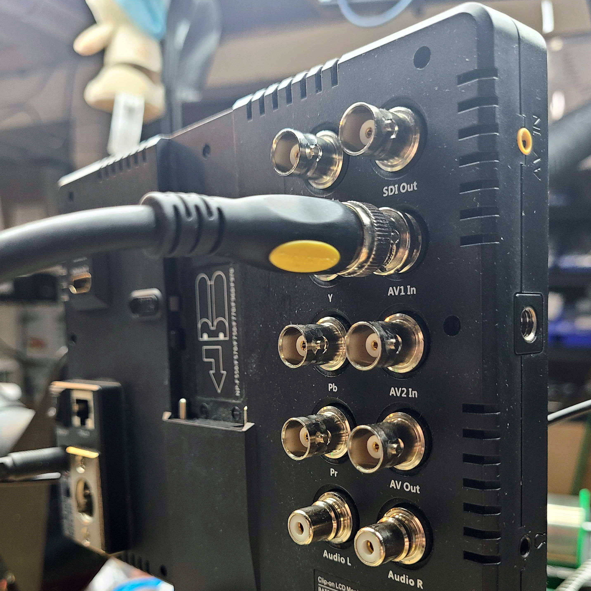
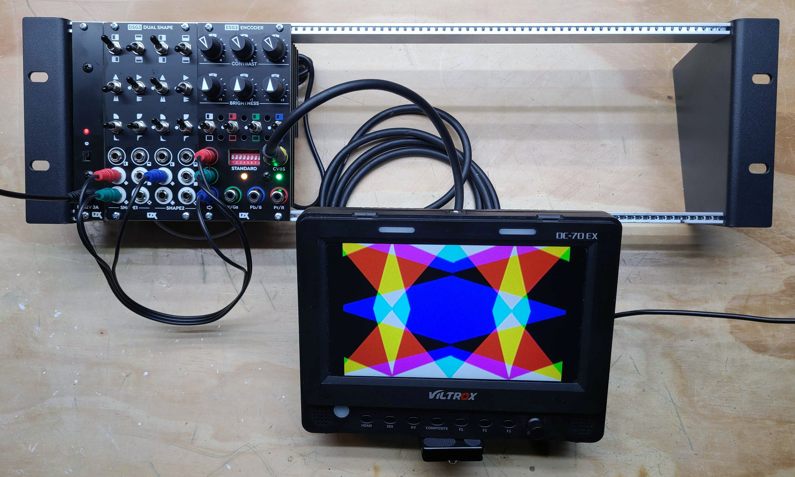
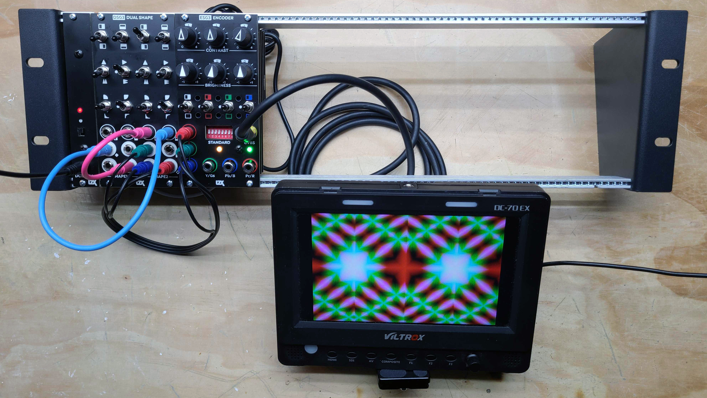
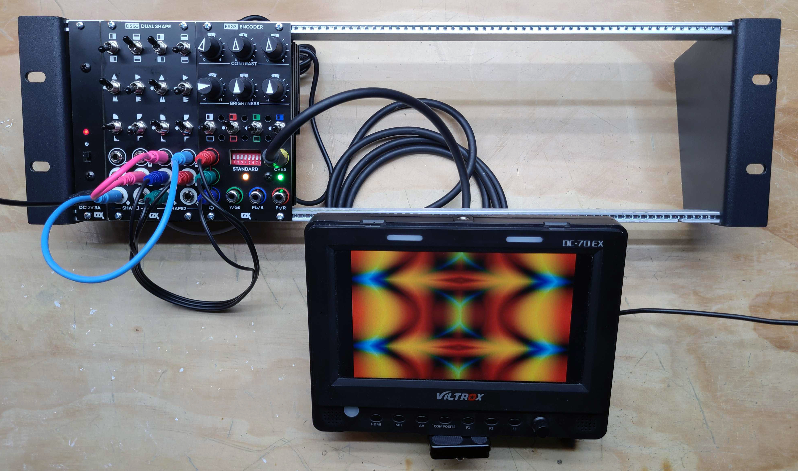

Getting Started
==============================================

What Is A Video Synthesizer?
----------------------------------------------

A video synthesizer is an electronic instrument which creates or processes video images in real time. A modular video synthesizer is comprised of one or more electronic modules. Each module performs a specific function, such as shape generation or color mixing. Modules are connected to each other with patch cables in an open ended manner which encourages experimentation and offers a wholly immersive creative experience. A large system of modules may be purchased at once, or it may be built up over time, according to an artist’s specific creative goals.

Quick Facts About LZX
----------------------------------------------

- The LZX mission is to preserve and expand upon tools available to the video art movement from the 1960s thru the 1980s. LZX exists as a counterpoint to the worlds of mainstream broadcast equipment and GPU based video processing software.
- LZX started as a DIY project in 2008, and then evolved through several series of modular instrument designs. Previous generations of LZX modules were referred to as the Visionary series (2011), Expedition series (2015), and Orion series (2018).  The current modular series (2022) is referred to as just LZX Modular, or Gen3.
- LZX products are manufactured in Portland, Oregon at the LZX workshop.
- Modules are compatible with EuroRack cases and patch cables used by modular audio synthesizers.
- Modules can be powered by 12V DC "wall wart" adapters or by EuroRack power supplies.
- External video inputs and outputs are the same as the Component & Composite connections found on most televisions and some cameras.
- Patchable signal levels are in the 0 to 1V range; This is lower than most audio modules (0V-10V), but inputs are tolerant of any voltage produced by a EuroRack system.
- Voltage control inputs are capable of very high frequencies, allowing signals such as camera images to modulate oscillators or VCAs.

.. image:: lzxart/GettingStartedWorkshop.jpg

Installing Modules
----------------------------------------------

Installing a new module in your system should be done in the following steps.  Always power down your system while installing a new module.

Connecting Power
^^^^^^^^^^^^^^^^^^^^^^^^^^^^^^^^^^^^^^^^^^^^^^

Your power supply must be connected to either the 12V DC input jack or the EuroRack power connector. Do not use both connectors at the same time.

Connecting Video Sync
^^^^^^^^^^^^^^^^^^^^^^^^^^^^^^^^^^^^^^^^^^^^^^

For each module with a Video Sync In on the rear, it must be connected to your ESG3 Encoder & Sync Generator module using an RCA cable.  This connection may be made directly, or through a chain of other modules.  ESG3 Encoder & Sync Generator may be connected to other ESG3 Encoder & Sync Generator modules in this manner, or its video sync input may be left disconnected.

Mounting
^^^^^^^^^^^^^^^^^^^^^^^^^^^^^^^^^^^^^^^^^^^^^^

Secure the module to your EuroRack mounting rails using the screws provided by your EuroRack case provider. 

Your First Patch
----------------------------------------------

This patch assumes you have followed the module installation instructions above, and your LZX Modular system is powered on.

Here's what you will need:

- ESG3 Encoder & Sync Generator module
- DSG3 Dual Shape Generator module 
- An RCA-to-RCA cable for composite video output
- A video display with composite video input
- Three 3.5mm patch cables

.. image:: lzxart/GettingStartedKit.jpg

Initial Settings
^^^^^^^^^^^^^^^^^^^^^^^^^^^^^^^^^^^^^^^^^^^^^^

All toggle switches on ESG3 and DSG3 should be reset to their center (middle) position.  All knobs on ESG3 should be set to their detented (middle) position.

Turn all of ESG3's front DIP switches to their OFF position.  If you want NTSC output, leave them all OFF.  If you want PAL output, turn switch #1 to the ON position.

Connecting A Video Display
^^^^^^^^^^^^^^^^^^^^^^^^^^^^^^^^^^^^^^^^^^^^^^

Connect your video display's CVBS input to your ESG3 Video Encoder & Sync Generator module's CVBS output.  

Generating A Color Pattern
^^^^^^^^^^^^^^^^^^^^^^^^^^^^^^^^^^^^^^^^^^^^^^

Patch any three of DSG3's eight outputs to your ESG3's Red, Green & Blue input jacks.  Play with the knobs and switches on ESG3 and DSG3, exploring the capabilities of your patternmaking patch.  Patch different outputs from DSG3 to observe different combinations.

Adding Complexity
^^^^^^^^^^^^^^^^^^^^^^^^^^^^^^^^^^^^^^^^^^^^^^

Next, let's make the geometry of your pattern capable of more complex results through series processing.  Patch two outputs from DSG3's first shape generator, to the inputs of it's second shape generator.  Now take your RGB pattern from the second shape generator's outputs.

