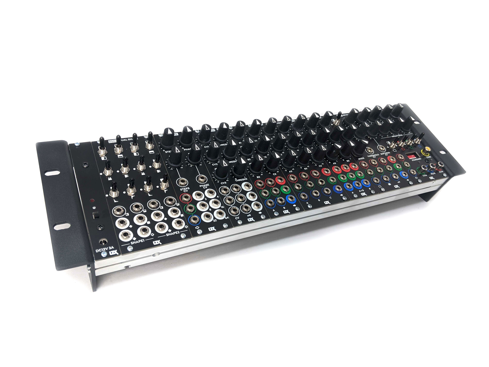

LZX Modular
===================================

A collection of EuroRack modules for *analog video synthesis* and *image processing*.

    
*Looking for legacy product docs?* 
Visit our GitHub repository at https://github.com/lzxindustries/lzxdocs and our user community at https://community.lzxindustries.net

*Looking for firmware binaries?* 
Visit our GitHub repository at https://github.com/lzxindustries/firmware

*Didn't find the answer you're looking for or have other questions?*
E-mail us at support@lzxindustries.net

This documentation site is a work in progress and may contain some placeholder content for now.  We plan to launch this site in a complete state in early September 2022.

.. toctree::
   gettingstarted
   modules
   concepts
   beginnerpatches
   standards
   testcal
   troubleshooting
   compatibility
   glossary
   
