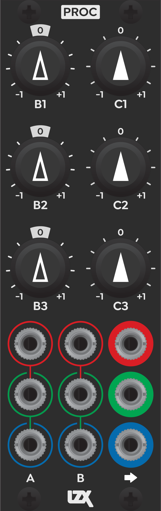
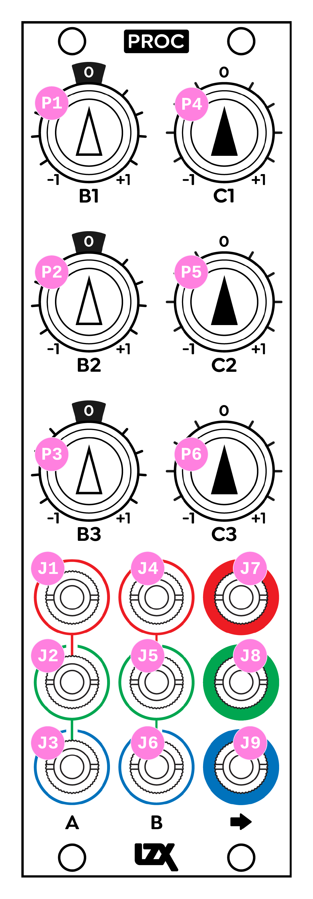

Proc
=========================================

Frontpanel Legend
-----------------------

   
+-----------------------+-----------------------+-----------------------------------------------------------+
| Ref                   | Description           | Range                                                     |
+=======================+=======================+===========================================================+
| P1                    | B1 Input Level        | -1X to +1X                                                |
+-----------------------+-----------------------+-----------------------------------------------------------+
| P2                    | B2 Input Level        | -1X to +1X                                                |
+-----------------------+-----------------------+-----------------------------------------------------------+
| P3                    | B3 Input Level        | -1X to +1X                                                |
+-----------------------+-----------------------+-----------------------------------------------------------+
| P4                    | C1 Bias               | -1V to +1V                                                |
+-----------------------+-----------------------+-----------------------------------------------------------+
| P5                    | C2 Bias               | -1V to +1V                                                |
+-----------------------+-----------------------+-----------------------------------------------------------+
| P6                    | C3 Bias               | -1V to +1V                                                |
+-----------------------+-----------------------+-----------------------------------------------------------+
| J1                    | A1 Input              | 0V to +1V, DC Coupled                                     |
+-----------------------+-----------------------+-----------------------------------------------------------+
| J2                    | A2 Input              | 0V to +1V, DC Coupled                                     |
+-----------------------+-----------------------+-----------------------------------------------------------+
| J3                    | A3 Input              | 0V to +1V, DC Coupled                                     |
+-----------------------+-----------------------+-----------------------------------------------------------+
| J4                    | B1 Input              | 0V to +1V, DC Coupled                                     |
+-----------------------+-----------------------+-----------------------------------------------------------+
| J5                    | B2 Input              | 0V to +1V, DC Coupled                                     |
+-----------------------+-----------------------+-----------------------------------------------------------+
| J6                    | B3 Input              | 0V to +1V, DC Coupled                                     |
+-----------------------+-----------------------+-----------------------------------------------------------+
| J7                    | Output 1              | 0V to +1V, DC Coupled                                     |
+-----------------------+-----------------------+-----------------------------------------------------------+
| J8                    | Output 2              | 0V to +1V, DC Coupled                                     |
+-----------------------+-----------------------+-----------------------------------------------------------+
| J9                    | Output 3              | 0V to +1V, DC Coupled                                     |
+-----------------------+-----------------------+-----------------------------------------------------------+
