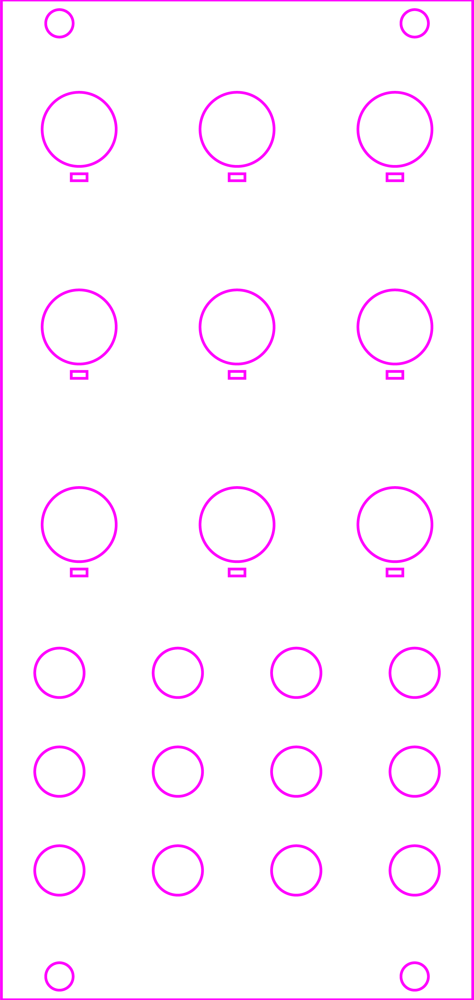
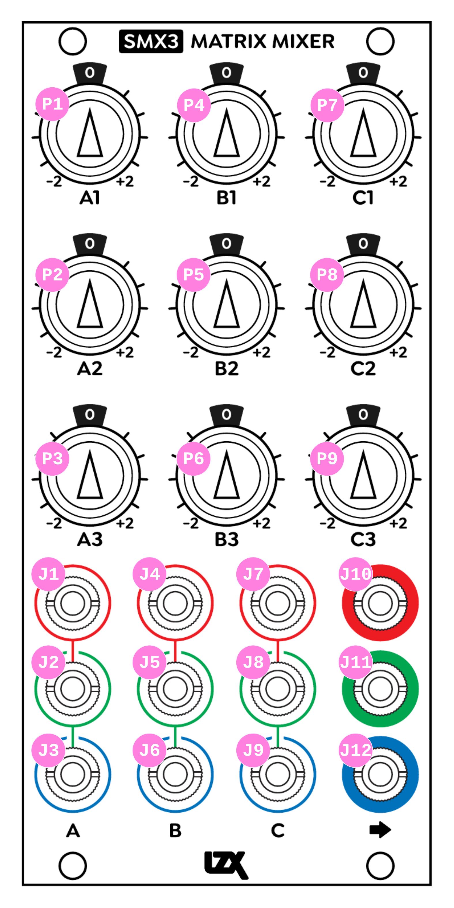

SMX3
=========================================

Frontpanel Legend
-----------------------

   
+-----------------------+-----------------------+-----------------------------------------------------------+
| Ref                   | Description           | Range                                                     |
+=======================+=======================+===========================================================+
| P1                    | A1 Level              | -2 to +2                                                  |
+-----------------------+-----------------------+-----------------------------------------------------------+
| P2                    | A2 Level              | -2 to +2                                                  |
+-----------------------+-----------------------+-----------------------------------------------------------+
| P3                    | A3 Level              | -2 to +2                                                  |
+-----------------------+-----------------------+-----------------------------------------------------------+
| P4                    | B1 Level              | -2 to +2                                                  |
+-----------------------+-----------------------+-----------------------------------------------------------+
| P5                    | B2 Level              | -2 to +2                                                  |
+-----------------------+-----------------------+-----------------------------------------------------------+
| P6                    | B3 Level              | -2 to +2                                                  |
+-----------------------+-----------------------+-----------------------------------------------------------+
| P7                    | C1 Level              | -2 to +2                                                  |
+-----------------------+-----------------------+-----------------------------------------------------------+
| P8                    | C2 Level              | -2 to +2                                                  |
+-----------------------+-----------------------+-----------------------------------------------------------+
| P9                    | C3 Level              | -2 to +2                                                  |
+-----------------------+-----------------------+-----------------------------------------------------------+
| J1                    | A1 Input              | 0V to +1V, DC Coupled                                     |
+-----------------------+-----------------------+-----------------------------------------------------------+
| J2                    | A2 Input              | 0V to +1V, DC Coupled                                     |
+-----------------------+-----------------------+-----------------------------------------------------------+
| J3                    | A3 Input              | 0V to +1V, DC Coupled                                     |
+-----------------------+-----------------------+-----------------------------------------------------------+
| J4                    | B1 Input              | 0V to +1V, DC Coupled                                     |
+-----------------------+-----------------------+-----------------------------------------------------------+
| J5                    | B2 Input              | 0V to +1V, DC Coupled                                     |
+-----------------------+-----------------------+-----------------------------------------------------------+
| J6                    | B3 Input              | 0V to +1V, DC Coupled                                     |
+-----------------------+-----------------------+-----------------------------------------------------------+
| J7                    | C1 Input              | 0V to +1V, DC Coupled                                     |
+-----------------------+-----------------------+-----------------------------------------------------------+
| J8                    | C2 Input              | 0V to +1V, DC Coupled                                     |
+-----------------------+-----------------------+-----------------------------------------------------------+
| J9                    | C3 Input              | 0V to +1V, DC Coupled                                     |
+-----------------------+-----------------------+-----------------------------------------------------------+
| J10                   | Output 1              | 0V to +1V, DC Coupled                                     |
+-----------------------+-----------------------+-----------------------------------------------------------+
| J11                   | Output 2              | 0V to +1V, DC Coupled                                     |
+-----------------------+-----------------------+-----------------------------------------------------------+
| J12                   | Output 3              | 0V to +1V, DC Coupled                                     |
+-----------------------+-----------------------+-----------------------------------------------------------+
