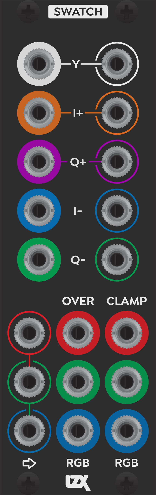

Swatch
=========================================

:HP: 8
:Power Consumption +12V: 140mA

Patching Tips
-----------------------------------------

Swatch is a deceptive module. On paper, it’s rather dry – a bidirectional color space converter with fixed color space, but the modular context of this function opens up some exciting use cases. Swatch is designed to interface RGB signals with parts of your system dealing with 2D vector processing (for Chroma processing) and waveshaping (for Luma processing). But even on it’s own, the interface has been designed to be highly hackable, through some patching tricks I’d like to share.

- Send an RGB source to the RGB inputs. Whatever source you choose, pick something with strong regions of color across all color channels. Patching from shapes and ramps makes this easy to achieve. If using a photographic source, use a Macaw parrot or something else with sloping luminance ranges and strong areas of saturated color. Test pattern bars aren’t as useful, due to the lack of any luma gradients to play with.
- Patch the RGB outputs (clamped or non) to your Encoder/output.
- At this stage, you should be seeing just a clean pass thru of RGB. The signal is being converted to YIQ, then converted back to RGB. Now you’re ready to try any of the patch hacks below.
- Invert Chroma. Patch the I- and Q- outputs to the I+ and Q+ inputs.
- Invert Chroma (First Axis Only). Patch the I- output to the I+ input.
- Invert Chroma (Second Axis Only). Patch the Q- output to the Q+ input.
- Swap Chroma. Patch the Q+ output to the I+ input. Patch the I+ output to the Q+ input.
- Remove Chroma / Desaturate. Patch 0V or a dummy cable to the I+ and Q+ inputs.
- Remove Chroma / Desaturate (First Axis Only). Patch 0V or a dummy cable to the I+ input.
- Remove Chroma / Desaturate (Second Axis Only). Patch 0V or a dummy cable to the Q+ input.
- Luma Replacement. Patch a shape or waveform into the Y input.
- Luma To Chroma. Patch the Y out to any of the I+, I-, Q+, Q- inputs.
- Chroma To Luma. Patch any of the I+, I-, Q+, Q- outputs to the Y input.
- Constant Luma. Patch a static offset (from Matte or Proc) to the Y input.
- Saturation Boost X2. Patch I- out to I- in, and Q- out to Q- input.
- Chroma Linear Displacement. Patch oscillators or offsets to the I- and Q- inputs.
- Chroma Orbital Displacement. Patch the Sin/Cos outputs from a quadrature oscillator to the I- and Q- inputs.

.. Frontpanel Legend
.. -----------------------

.. .. figure:: lzxart/Swatch/Legend.png
..    :height: 600
..    :alt: Proc frontpanel legend
   
.. +-----------------------+-----------------------+-----------------------------------------------------------+
.. | Ref                   | Description           | Range                                                     |
.. +=======================+=======================+===========================================================+
.. | P1                    | A1 Level              | -1 to +1                                                  |
.. +-----------------------+-----------------------+-----------------------------------------------------------+
.. | P2                    | A2 Level              | -1 to +1                                                  |
.. +-----------------------+-----------------------+-----------------------------------------------------------+
.. | P3                    | A3 Level              | -1 to +1                                                  |
.. +-----------------------+-----------------------+-----------------------------------------------------------+
.. | P4                    | B1 Level              | -1 to +1                                                  |
.. +-----------------------+-----------------------+-----------------------------------------------------------+
.. | P5                    | B2 Level              | -1 to +1                                                  |
.. +-----------------------+-----------------------+-----------------------------------------------------------+
.. | P6                    | B3 Level              | -1 to +1                                                  |
.. +-----------------------+-----------------------+-----------------------------------------------------------+
.. | J1                    | A1 Input              | 0V to +1V, DC Coupled                                     |
.. +-----------------------+-----------------------+-----------------------------------------------------------+
.. | J2                    | A2 Input              | 0V to +1V, DC Coupled                                     |
.. +-----------------------+-----------------------+-----------------------------------------------------------+
.. | J3                    | A3 Input              | 0V to +1V, DC Coupled                                     |
.. +-----------------------+-----------------------+-----------------------------------------------------------+
.. | J4                    | B1 Input              | 0V to +1V, DC Coupled                                     |
.. +-----------------------+-----------------------+-----------------------------------------------------------+
.. | J5                    | B2 Input              | 0V to +1V, DC Coupled                                     |
.. +-----------------------+-----------------------+-----------------------------------------------------------+
.. | J6                    | B3 Input              | 0V to +1V, DC Coupled                                     |
.. +-----------------------+-----------------------+-----------------------------------------------------------+
.. | J7                    | Output 1              | 0V to +1V, DC Coupled                                     |
.. +-----------------------+-----------------------+-----------------------------------------------------------+
.. | J8                    | Output 2              | 0V to +1V, DC Coupled                                     |
.. +-----------------------+-----------------------+-----------------------------------------------------------+
.. | J9                    | Output 3              | 0V to +1V, DC Coupled                                     |
.. +-----------------------+-----------------------+-----------------------------------------------------------+
