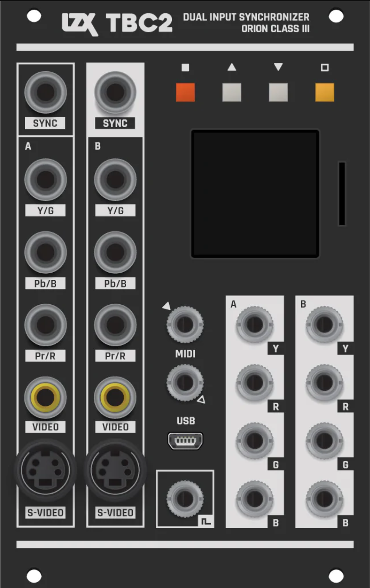

TBC2
===============

TBC2 is a dual video input module for your LZX modular system. 

:HP: 16
:Power Consumption +12V: 550mA

Submodules
-----------------------------

Decoder
+++++++++++++++++++++++++++++

TBC2 has two input decoder submodules.  Each supports Component (YPbPr/RGsB), Composite (CVBS) and S-Video (YC) inputs.  With the addition of the VGA/SCART expander, it supports VGA (RGBHV) and SCART (CVBS/RGsB) inputs. 

+------------------+
| Input Standard   | 
+==================+
| NTSC             |
+------------------+
| PAL              |
+------------------+
| 480p             |
+------------------+
| 576p             |
+------------------+
| 720p50           |
+------------------+
| 720p5994         |
+------------------+
| 720p60           |
+------------------+
| 1080i50          |
+------------------+
| 1080i5994        |
+------------------+
| 1080i60          |
+------------------+
| 1080p2398        |
+------------------+
| 1080p24          |
+------------------+
| 1080p25          |
+------------------+
| 1080p2997        |
+------------------+
| 1080p30          |
+------------------+
| 640x480p60       |
+------------------+
| 800x600p60       |
+------------------+
| 1024x768p60      |
+------------------+

Genlock 
+++++++++++++++++++++++++++++

TBC2 has one genlock submodule.  This module controls the timing of the output encoders.  It is a full featured Sync Generator with front and rear outputs for video sync. 

+------------------+
| Output Standard  | 
+==================+
| NTSC             |
+------------------+
| PAL              |
+------------------+
| 480p             |
+------------------+
| 576p             |
+------------------+
| 720p50           |
+------------------+
| 720p5994         |
+------------------+
| 720p60           |
+------------------+
| 1080i50          |
+------------------+
| 1080i5994        |
+------------------+
| 1080i60          |
+------------------+
| 1080p2398        |
+------------------+
| 1080p24          |
+------------------+
| 1080p25          |
+------------------+
| 1080p2997        |
+------------------+
| 1080p30          |
+------------------+

Encoder
+++++++++++++++++++++++++++++

TBC2 has two output encoder submodules.  Each supports Patchable 1V (YRGB) outputs.  The output video standard follows the setting of the Genlock Module.

Media
+++++++++++++++++++++++++++++

TBC2 has one media submodule.  This module is capable of loading still images (JPG, PNG, BMP) from the front MicroSD card socket.  The output video standard follows the setting of the Genlock Module.

To use the media module, copy your images into a subfolder of a compatible MicroSD card.  For example:

/media/folder/frame1.JPG

We recommend preparing media in a size matching your system's output video standard in JPG or PNG formats.  For example, for NTSC video, prepare media at 720 (W) x 486 (H) dimensions.

Always eject or insert your MicroSD card only when your system is powered off.  Keep remote backups of any data on your MicroSD card.

The maximum number of images per media folder is determined by the current output video standard, with a minimum of 24 frames in 1920 (W) x 1080 (H) media sizes.

Ramp Generator
+++++++++++++++++++++++++++++

TBC2 has one Ramp Generator submodule. The output video standard follows the setting of the Genlock Module.  The Ramp Generator is a low speed software renderer designed to generate programmable gradients and other patterns.  After any settings change, this module will render a new output frame. 

MicroSD Card Compatibility
-----------------------------

TBC2 is compatible with some, but not all MicroSD cards.  When you acquire a MicroSD card to use with TBC2, we recommend selecting from the specific brands and models we have tested to be hassle free, listed below. Always purchase MicroSD cards from a trusted vendor with name brand packaging to protect yourself against counterfeits.  To prepare your MicroSD card for use with TBC2, please format the card as FAT32 with default sector size.

+------------------+-----------+
| Brand / Series   | Size      | 
+==================+===========+
| SanDisk          | 8GB, 16GB | 
+------------------+-----------+
| SanDisk EDGE     | 8GB       | 
+------------------+-----------+

MIDI Control Change Map
-----------------------------

+---------+--------------+-------------------------+
| CC      | Module       | Parameter               |
+=========+==============+=========================+
| 0       | Encoder A    | Crossfade               |
+---------+--------------+-------------------------+
| 1       | Decoder A    | SD Processor Hue        |
+---------+--------------+-------------------------+
| 2       | Decoder A    | SD Processor Saturation |
+---------+--------------+-------------------------+
| 3       | Decoder A    | SD Processor Brightness |
+---------+--------------+-------------------------+
| 4       | Decoder A    | SD Processor Contrast   |
+---------+--------------+-------------------------+
| 16      | Encoder B    | Crossfade               |
+---------+--------------+-------------------------+
| 17      | Decoder B    | SD Processor Hue        |
+---------+--------------+-------------------------+
| 18      | Decoder B    | SD Processor Saturation |
+---------+--------------+-------------------------+
| 19      | Decoder B    | SD Processor Brightness |
+---------+--------------+-------------------------+
| 20      | Decoder B    | SD Processor Contrast   |
+---------+--------------+-------------------------+

Firmware Releases
-----------------------------

+-----------+---------------------+-------------------------------------------------------------------------------------+-------------------------------------------------------------------------------------+
| Version   | Release Date        | Download                                                                            | Notes                                                                               |
+===========+=====================+=====================================================================================+=====================================================================================+
| 1.0       | 01.04.2023          | :download:`TBC2_Firmware_1.0.zip <firmware/TBC2_Firmware_1.0.zip>`                  | Initial release                                                                     |
+-----------+---------------------+-------------------------------------------------------------------------------------+-------------------------------------------------------------------------------------+
| 1.0.1     | 02.13.2023          | :download:`TBC2_Firmware_1.0.1.zip <firmware/TBC2_Firmware_1.0.1.zip>`              | Progressive sync, NTSC field order                                                  |
+-----------+---------------------+-------------------------------------------------------------------------------------+-------------------------------------------------------------------------------------+

Firmware Update
-----------------------------

1. Download the latest firmware package from the releases section, and unzip the files.  Find BOOT.bin and copy it to your MicroSD card.
2. Power down your TBC2 and insert the MicroSD card.
3. Power on your system and wait for TBC2 to finish booting, then activate the Update Firmware button on  the System page.
4. Wait for firmware update to complete, until you see the System Restart prompt.  Activate the Confirm button to restart your system.
5. Confirm that your TBC2 boots to the correct version by comparing version numbers on the System Page.  Power off / power on your system if you see the wrong version initially. 

Factory Reset
-----------------------------

1. To reset your TBC2 firmware to the version shipped from the factory, activate the Reset Firmware button on the System page.
2. Wait for firmware reset to complete, until you see the System Restart prompt.  Activate the Confirm button to restart your system.
3. Confirm that your TBC2 boots to the factory installed version by comparing version numbers on the System Page.  Power off / power on your system if you see the wrong version initially. 

